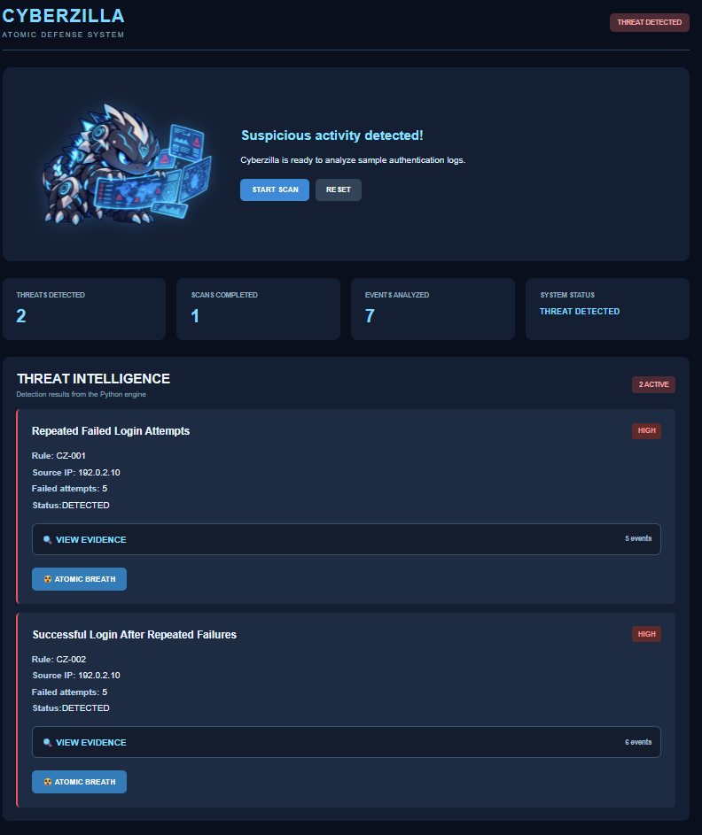

# CYBERZILLA 🦖
### Atomic Defense System

A beginner-friendly cybersecurity project that analyzes authentication logs, detects suspicious login patterns, and displays investigable security alerts in a kaiju-inspired dashboard.



> **Project scope:** Cyberzilla currently analyzes synthetic authentication events. Its **ATOMIC BREATH** response is a visual simulation; it does not block IP addresses, disable accounts, remove malware, or protect a live system.

## Features

- **Authentication log analysis:** Processes sample login events using a Python detection engine.
- **Rule-based threat detection:** Identifies repeated failed logins and successful logins following repeated failures.
- **Evidence viewer:** Displays the events associated with each alert.
- **Interactive dashboard:** Shows scan results, event counts, alert details, and simulated responses.
- **REST API:** Connects the Vue frontend to the Python detection engine through FastAPI.
- **Automated tests:** Uses pytest to check detection behavior and GitHub Actions to run tests on pushes and pull requests.

## Detection Rules

| Rule | Detection logic | Why it matters |
| --- | --- | --- |
| **CZ-001** | Five failed login attempts from the same source IP within 60 seconds. | Highlights repeated authentication failures that may warrant investigation. |
| **CZ-002** | Five failed attempts followed by a successful login for the same username and source IP within 60 seconds. | Highlights a login sequence that may warrant further investigation. A successful login alone does not prove account compromise. |

The included sample dataset contains **seven synthetic authentication events** and produces **two alerts**.

## Technology Stack

| Component | Technology |
| --- | --- |
| Detection engine | Python |
| API | FastAPI and Uvicorn |
| Dashboard | Vue and Vite |
| Tests | pytest |
| Continuous integration | GitHub Actions |

## How It Works

```text
Synthetic authentication logs (JSON)
                 |
                 v
       Python detection engine
          CZ-001 / CZ-002
                 |
                 v
        FastAPI: POST /api/scan
                 |
                 v
          Vue dashboard
                 |
                 v
    Alerts + evidence + simulated
          ATOMIC BREATH response
```

When a user selects **START SCAN**, the frontend sends a request to the FastAPI endpoint. The backend analyzes the sample authentication events and returns the detection results. The dashboard then displays the alerts and their supporting evidence.

Selecting **ATOMIC BREATH** changes an alert's displayed status to simulate a defensive response. **No real security control is executed.**

## Run Locally

### Prerequisites

Install:

- Python 3
- Node.js and npm
- Git

### 1. Clone the repository

```bash
git clone https://github.com/marcoas19/Cyberzilla.git
cd Cyberzilla
```

### 2. Set up the backend

Open a terminal in the repository's `backend` directory:

```powershell
cd backend
python -m venv .venv
.\.venv\Scripts\python.exe -m pip install -r requirements.txt
```

Start the API **from the `backend` directory**:

```powershell
.\.venv\Scripts\python.exe -m uvicorn api:app --reload --port 8000
```

**Important:** This command assumes the FastAPI application is defined as `app` in `backend/api.py`. If your working application is defined in a different file, use that file's module name instead.

Open the interactive API documentation:

http://127.0.0.1:8000/docs

Expand `POST /api/scan`, select **Try it out**, and then select **Execute** to test the endpoint.

### 3. Start the frontend

Keep the backend terminal running. Open a **second terminal** in the repository's `frontend` directory:

```powershell
cd frontend
npm install
npm run dev
```

Open the local URL displayed by Vite, typically:

http://localhost:5173/

Select **START SCAN** to analyze the sample logs and explore the alerts.

**Note:** The frontend currently calls the API at `http://127.0.0.1:8000`. Both services must be running on the same computer for this local setup to work.

## Run the Tests

From the repository's root directory, with the backend dependencies installed:

```powershell
.\backend\.venv\Scripts\python.exe -m pytest -v
```

The tests cover the detection rules, normal login activity, time-window behavior, and separation of events belonging to different users.

GitHub Actions also runs the Python tests when changes are pushed or a pull request is opened.

## Current Limitations

Cyberzilla is an educational prototype, **not an antivirus, production SIEM, or active intrusion-prevention system**.

- It reads a sample JSON dataset rather than collecting live authentication logs.
- Its rules identify patterns for investigation; they do not establish that an account has been compromised.
- ATOMIC BREATH simulates a response in the dashboard without changing firewall rules, accounts, sessions, or the source logs.
- The local frontend requires the backend API to be running separately.

## Future Improvements

- Ingest authentication logs from a controlled lab environment.
- Add more detection rules and configurable thresholds.
- Persist scan history and analyst notes.
- Improve alert filtering and investigation workflows.
- Explore authorized, reversible response actions in a dedicated test environment.

## Author

**Marco Aguilar**

Cybersecurity student building practical projects in Python, web development, security monitoring, and detection engineering.

## Acknowledgments

Special thanks to my wife, Lady, for her love, patience, and encouragement throughout my journey in cybersecurity. Her thoughtful questions remind me that understanding a technology also means being able to explain it clearly to others.

I am also grateful to my family for supporting my education and giving me the motivation to keep learning and building.

Finally, thanks to ChatGPT (Moka) for providing guidance, explanations, and debugging assistance during the development of Cyberzilla.

Cyberzilla was designed, implemented, tested, and documented by Marco Aguilar as a hands-on learning project.